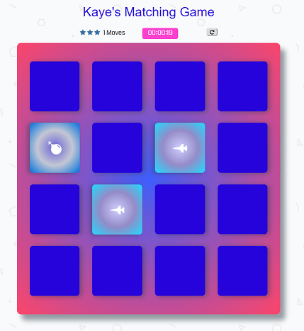

<h1>Memory Game Project</h1>

<h2>How to play</h2>
<ul>
	<li>Open https://kayezhie.github.io/Memory_Game/ to play the game.</li>
	<li>Clicking on tiles will flip them over so that you can see what lies on them.</li>
	<li>Your goal is to match two tiles of the same type at a time.</li>
	<li>Then try to match all pairs in as minimum moves as possible.</li>
	<li>At the end of the game it will show how much time you spent, and rate base on the moves have made.
	<li>You can restart the game as many as you can.</li>
</ul>

<h2>Screenshot</h2>
	

<h2>External libraries Used</h2>
<ul>
	<li>jQuery</li>
	<li>https://fonts.googleapis.com/css?family=Coda</li>
	<li>https://maxcdn.bootstrapcdn.com/font-awesome/4.6.1/css/font-awesome.min.css</li>
</ul>